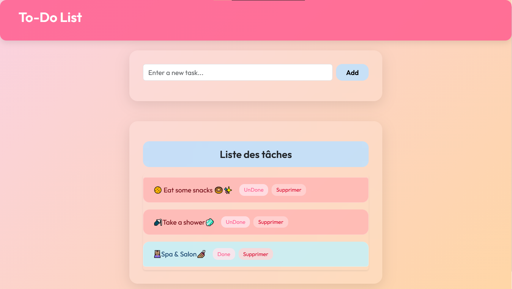
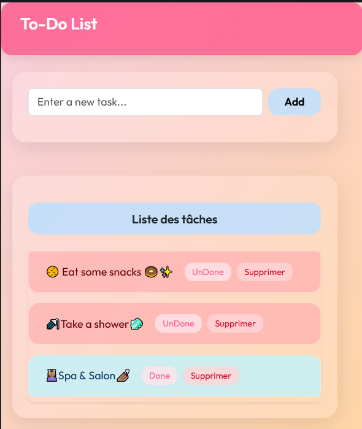

# "Todo_Liste" Projet

Une simple PHP/MySQL "To-Do List" application crée en binôme.

## Setup
1. Importer `sql/db.sql` en phpMyAdmin.
2. Placer le project dans le fichier `httdocs` (XAMPP).
3. Executer `http://localhost/Todo_Liste`.
Bien sûr Nouhaila 🌟 ! Voici ton **rapport complet en français** au format Markdown (`.md`), prêt à être collé dans Visual Studio Code, GitHub ou tout éditeur compatible :

---

```markdown
# 📋 Rapport de projet : Application To-Do List en PHP et MySQL

## 🗂️ 1. Page de couverture

**Titre du projet :** Application To-Do List en PHP et MySQL  
**Nom :** Nouhaila  
**Année scolaire :** 2025–2026

---

## 📘 2. Introduction

Ce projet consiste à développer une application web permettant de gérer des tâches quotidiennes. L’utilisateur peut ajouter, marquer comme faites ou non faites, et supprimer des tâches. L’interface est simple, intuitive et responsive, adaptée à tous les types d’appareils.

---

## 🛠️ 3. Technologies utilisées

| Technologie | Rôle |
|-------------|------|
| PHP         | Traitement côté serveur |
| MySQL       | Base de données |
| HTML        | Structure de la page |
| CSS         | Mise en forme |
| Bootstrap   | Design responsive |

---

## ✅ 4. Fonctionnalités principales

- **Ajouter une tâche**  
- **Marquer comme faite / non faite**  
- **Supprimer une tâche**  
- **Interface responsive**

---

## 🧱 5. Structure du projet

```
/todo-app/
│
├── index.php
├── db.php
├── add.php
├── update.php
├── delete.php
├── assets/
│   ├── css/
│   │   └── style.css
│   └── js/
│       └── script.js
└── screenshots/
    ├── interface.jpeg
    ├── mobile.jpeg
    └── vscode.png
```

---

## 🗄️ 6. Base de données

La base de données contient une table `todo` avec les champs suivants :

| Champ        | Type         | Description                       |
|--------------|--------------|-----------------------------------|
| `id`         | INT (PK)     | Identifiant unique |
| `title`      | VARCHAR(255) | Titre de la tâche |
| `done`       | BOOLEAN      | État (faite ou non) |
| `created_at` | DATETIME     | Date de création |

---

## 🧩 7. Code principal

### Connexion à la base (`db.php`)
```php
$conn = new mysqli('localhost', 'root', '', 'todo_db');
```

### Ajouter une tâche (`add.php`)
```php
$title = $_POST['title'];
$conn->query("INSERT INTO todo (title, done, created_at) VALUES ('$title', 0, NOW())");
```

### Mettre à jour l’état (`update.php`)
```php
$id = $_GET['id'];
$conn->query("UPDATE todo SET done = NOT done WHERE id = $id");
```

### Supprimer une tâche (`delete.php`)
```php
$id = $_GET['id'];
$conn->query("DELETE FROM todo WHERE id = $id");
```

---

## 🖼️ 8. Captures d’écran

### 🖥️ Interface principale


### 📱 Version mobile


### 💻 Fichier README dans VS Code


---

## 🧪 9. Tests réalisés

| Fonctionnalité         | Résultat attendu        | Statut |
|------------------------|-------------------------|--------|
| Ajout de tâche         | Tâche visible           | ✅     |
| Marquer comme faite    | Tâche complétée         | ✅     |
| Suppression            | Tâche supprimée         | ✅     |
| Responsive mobile      | Affichage adapté        | ✅     |

---

## 🚀 10. Améliorations possibles

- Ajout d’un système d’utilisateurs
- Priorisation des tâches
- Recherche et filtrage
- Notifications par email

---

## 🎓 11. Conclusion

Ce projet m’a permis de renforcer mes compétences en développement web, notamment en PHP et MySQL. Il m’a aussi sensibilisée à l’importance de l’ergonomie et de la responsivité dans les interfaces modernes. L’application est fonctionnelle et constitue une base solide pour des évolutions futures.

```

---

 add
