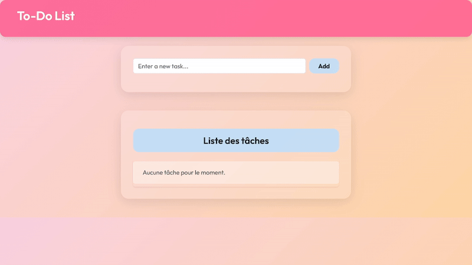

# "Todo_Liste" Projet

Une simple PHP/MySQL "To-Do List" application crée en binôme.

## Setup
1. Importer `sql/db.sql` en phpMyAdmin.
2. Placer le project dans le fichier `httdocs` (XAMPP).
3. Executer `http://localhost/Todo_Liste`.

---


# 📋 Rapport de projet : Application To-Do List en PHP et MySQL

## 🗂️ 1. Page de couverture

**Titre du projet :** Application To-Do List en PHP et MySQL

**Développé par :** [ Nouhaila BOUTRIQUE ] et [ Afaf AHADAD ] dans le cadre d'un projet collaboratif.

---

## 📘 2. Introduction

Ce projet consiste à développer une application web permettant de gérer des tâches quotidiennes. L’utilisateur peut ajouter, marquer comme faites ou non faites, et supprimer des tâches. L’interface est simple, intuitive et responsive, adaptée à tous les types d’appareils.

---

## 🛠️ 3. Technologies utilisées

| Technologie | Rôle |
|-------------|------|
| PHP         | Traitement côté serveur |
| MySQL       | Base de données |
| HTML        | Structure de la page |
| CSS         | Mise en forme |
| Bootstrap   | Design responsive |

---

## ✅ 4. Fonctionnalités principales

- **Ajouter une tâche**  
- **Marquer comme faite / non faite**  
- **Supprimer une tâche**  
- **Interface responsive**

---

## 🧱 5. Structure du projet

```
/Todo-Liste/
│
├──── config/
│     └── connexion.php
├──── front-end/
│     └─── includes/
│          └─── header.php
│     └── public/
│          └─── style.css
│     └── templates/
│       │── add-task-form.php
│       └── tasks-list.php
├── images/
│       │── phone_view.png
│       │── toDoList_view.gif
│       └── web_view.png
│──── sql/
│      └── db.sql
│── README.md
└── index.php
    
```

---

## 🗄️ 6. Base de données

La base de données contient une table `todo` avec les champs suivants :

| Champ        | Type         | Description                       |
|--------------|--------------|-----------------------------------|
| `id`         | INT (PK)     | Identifiant unique |
| `title`      | VARCHAR(2048) | Titre de la tâche |
| `done`       | BOOLEAN      | État (faite ou non) |
| `created_at` | DATETIME     | Date de création |

---

## 🖼️ 7. Captures d’écran

### 🖥️ Interface principale


### 📱 Version mobile


### 📷 Capture video


---

## 🧪 10. Tests réalisés

| Fonctionnalité         | Résultat attendu        | Statut |
|------------------------|-------------------------|--------|
| Ajout de tâche         | Tâche visible           | ✅     |
| Marquer comme faite    | Tâche complétée         | ✅     |
| Suppression            | Tâche supprimée         | ✅     |
| Responsive mobile      | Affichage adapté        | ✅     |

---

## 🚀 11. Améliorations possibles

- Ajout d’un système d’utilisateurs
- Priorisation des tâches
- Recherche et filtrage
- Notifications par email

---

## 🎓 12. Conclusion

📌📌En plus de consolider nos compétences en développement web (PHP/MySQL), ce projet nous a permis 
de **parfaire notre maîtrise de Git et des workflows collaboratifs sur GitHub**. L'accent a également 
été mis sur l'ergonomie et la responsivité, livrant ainsi une application fonctionnelle et extensible.


